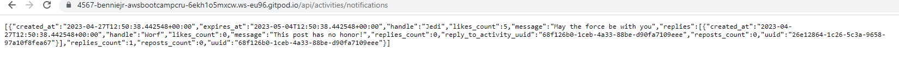
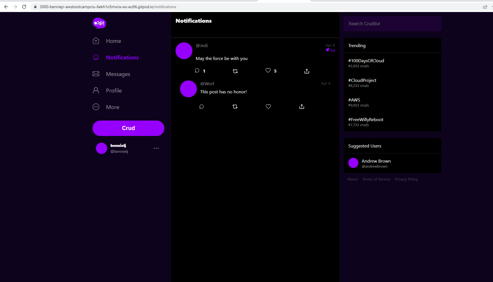

# Week 1 — App Containerization

## Required Tasks

### Watch The Videos

I was able to watch the Week 1 live stream, Chirag's tutorial on spend considerations, Ashish's tutorial on container security consideration and the other videos on asking for technical help and homework grading.

### Containerize Application

I wrote dockerfiles for both the frontend and backend. I wrote and added a docker compose file for the application to run the containers at the same time.

### Document the Notification Endpoint for the OpenAPI Document

I added a notifications endpoint and a path to the notifications api to the OpenAPI yaml file. 

### Write a Flask Backend Endpoint for Notifications
I also connected notifications to both the frontend(react) and the backend(flask). For the backend, to define a new endpoint for the notifications I have to define routes in the entry point to the app which is the [app.py]([backend-flask/app.py](https://github.com/bennie-jr/aws-bootcamp-cruddur-2023/blob/main/backend-flask/app.py)) file. I also created a [notifications_activities.py](https://github.com/bennie-jr/aws-bootcamp-cruddur-2023/blob/main/backend-flask/services/notifications_activities.py) file to mock up some data and connected it to the app.py file to import it.

### Write a React Page for Notifications Feature
I created a route in the entry point [app.js](https://github.com/bennie-jr/aws-bootcamp-cruddur-2023/blob/main/frontend-react-js/src/App.js) since the app uses react router and mapped it to the notification feed page. I created the [notifications feed page](https://github.com/bennie-jr/aws-bootcamp-cruddur-2023/blob/main/frontend-react-js/src/pages/NotificationsFeedPage.js) in the pages folder and connected the backend and the api endpoint.

